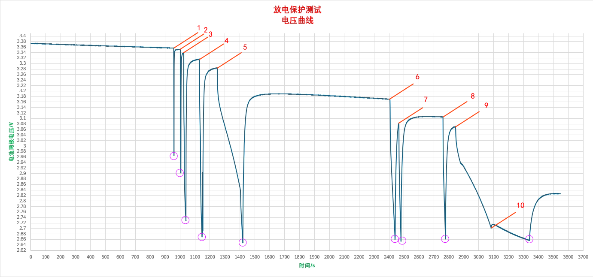

# V10

**实验目的：**

​	`DW06`的过放保护电压约为2.5V，大负载时对电池损伤不大，但当使用小负载持续放电时，放电至2.5V对电池损失较大。因此将`DW06`更换为`DW07`，其过放保护电压约为2.8V.

**实验内容：**

`	DW06`与`DW07`封装、引脚完全一致，因此仅需更换PCBA上的芯片即可。

**实验结果：**

​	更换后用电子负载仪进行了放电实验，结果（记录于[表](DischargingProtection.xlsx)中）如下图所示

​	实验使用电子负载仪的**恒流**模式，用一块3.7V软包电池通过模块的5.0V输出端子放电，表中电压指电池两极电压差。

​	可以看出过放截止的保护阈值（图中紫色圆圈处的数据点）均在2.7V附近，与`DW06`方案相比显著提升

​	对上图的具体说明如下：

| 数据点序号 | 在该数据点出进行的操作 |
| ---------- | ---------------------- |
| 1          | 接入3.0A负载           |
| 2          | 接入2.5A负载           |
| 3          | 接入2.0A负载           |
| 4          | 接入1.5A负载           |
| 5          | 接入1.3A负载           |
| 6          | 接入1.3A负载           |
| 7          | 接入1.28A负载          |
| 8          | 接入1.26A负载          |
| 9          | 接入1.25A负载          |
| 10         | 接入50mA负载           |

​	1~4可看出在电量低时，接入大负载会立即触发保护，且负载越大保护触发得越快，5~9可看出在低电量时，模块所能输出的最大负载约为 ***5V@1.25A***，10及之后可看出小负载放电时会将电池电压降至更低水平，故此次对过放保护电压的提高很有必要。

​	且从图中可以看出触发过放保护的阈值电压仍然不够高，因此后续有必要采用分压采样等方式进一步提高此阈值电压。

**实验日期：**

2024.08.21
